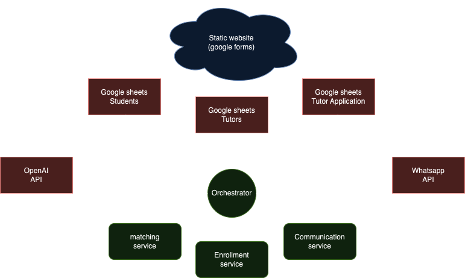

# IE Tutoring Frontend

This repository contains the frontend for the IE Tutoring platform. It operates as an "invisible" app: the customer interacts through everyday apps like WhatsApp, believing they’re communicating with a person, but everything is fully automated. Imagine the appeal of a local restaurant with the efficiency of a multinational chain.

The backend is built with a microservices architecture and managed using Docker Compose for seamless deployment. It includes services for matching, enrollment, and communication, all coordinated by a central API Orchestrator. This Aggregator connects to external services like Google, WhatsApp, and OpenAI, providing access to these services through HTTP requests.

## Table of Contents
- [Overview](#overview)
- [Features](#features)
- [Architecture](#architecture)
- [Getting Started](#getting-started)
- [Environment Variables](#environment-variables)
- [Usage](#usage)
- [GitHub Actions Workflow](#github-actions-workflow)
- [Contributing](#contributing)
- [License](#license)

## Overview

This project enables IE Tutoring to manage various backend processes, including student-tutor connections, tutor recruiting, communication and accounting. Key functionalities include handling form submissions, managing enrollments, and orchestrating API calls to Google Sheets, WhatsApp, and other third-party services.

## Features

- **Microservice Architecture:** Separate services for orchestrator, enrollment, communication and matching.
- **API Orchestration:** Orchestrator service for managing API calls.
- **Scheduled Jobs:** Use GitHub Actions for automated, scheduled deployment.

## Architecture

This backend is designed using a microservices architecture. Each service is isolated and can be managed and deployed independently. The primary services include:

- **Orchestrator:** Main service that coordinates API calls to other services.
- **Matching Service:** Matches students with tutors
- **Communication Service:** Contacts student and tutors based on the matchings outcome.
- **Enrollment Service:** Manages tutor applications.

## Getting Started

### Prerequisites

- **Docker:** Ensure Docker and Docker Compose are installed.
- **Python 3.8+** (if running services locally)
- **GitHub Secrets:** For running GitHub Actions workflows, set up the following secrets:
  - `GCP_CREDENTIALS`: Base64-encoded Google Cloud credentials
  - `GITHUB_TOKEN`: For logging in to GitHub’s Container Registry

### License

Distributed under the MIT License.
